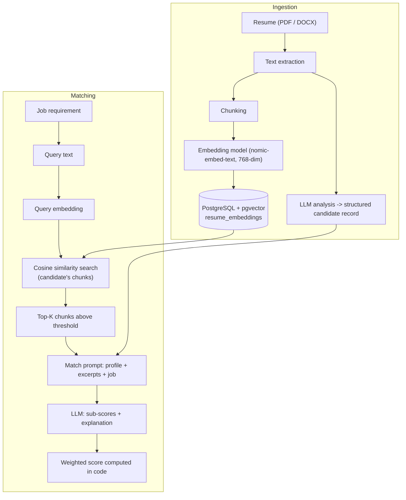
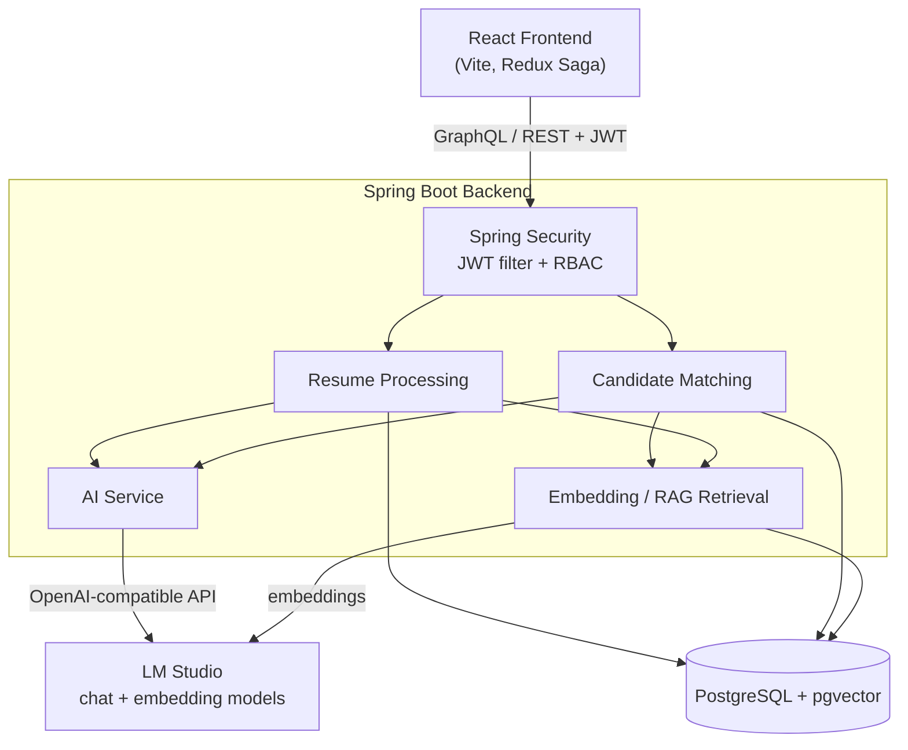

# 🤖 Agentic AI Recruitment Platform

An AI-powered recruitment platform that combines **local LLMs, RAG, pgvector semantic search, and structured candidate evaluation** to analyze resumes and match candidates with job requirements. Everything runs locally: the LLM and embedding models are served by **LM Studio**, so no resume data leaves your machine.


---

## 🚀 Overview

Screening resumes by keyword is slow and misses context. This platform turns uploaded resumes into **structured candidate profiles and searchable vector embeddings**, then evaluates each candidate against a job requirement using **the resume passages most relevant to that job**.

It goes beyond a resume parser: it covers the full flow from upload to a ranked, explainable match.

```text
Resume ─► Text Extraction ─► LLM Analysis ─► Chunking ─► Embeddings ─► pgvector
                                                                          │
Job Requirement ─► Query Embedding ─► Cosine Search ─► Top-K Chunks ◄─────┘
                                                            │
                                  LLM Evaluation (sub-scores + explanation)
                                                            │
                          Weighted Score (computed in code) ─► Candidate Ranking
```

---

## ✨ Key Features

- **Resume ingestion**: upload PDF, DOC/DOCX, or a ZIP of resumes; text is extracted with Apache PDFBox / Apache POI.
- **AI resume analysis**: the LLM extracts name, email, phone, skills, domain knowledge, education, experience summary, years of experience, and social profile links into a structured candidate record.
- **Embeddings in PostgreSQL + pgvector**: resumes are chunked and embedded (768-dim) and stored in a `vector(768)` column.
- **RAG-based matching**: the job requirement is embedded, the candidate's most similar resume chunks are retrieved with a cosine similarity search, and passed to the LLM as evidence.
- **Deterministic weighted score**: the LLM returns sub-scores; the application computes the final score.
- **Job requirements & skills management**, candidate shortlisting/selection, match audit history.
- **GraphQL API** (plus REST for authentication and file upload) with GraphiQL.
- **JWT authentication and role-based access control** (`ADMIN`, `RECRUITER`, `HIRING_MANAGER`, `HR`).
- **Asynchronous processing**: uploads are processed with `@Async`; an optional database-backed job queue with a scheduler is available behind a feature flag.
- **Optional external profile enrichment** (GitHub, LinkedIn, Twitter/X, internet search) to add context to matches.
- **React frontend** (TypeScript, Redux Toolkit, Redux Saga, Vite).
- **Graceful failure handling**: failed AI analysis, empty/scanned PDFs, and an unavailable LLM mark the file as failed instead of saving placeholder data or overwriting real scores.
- **Local inference** through LM Studio's OpenAI-compatible API.

---

## 🧠 AI & RAG Architecture



**What gets embedded.** The full resume text is split into chunks: first on blank lines, and sections over ~1000 characters are split further on sentence boundaries. Each chunk is embedded with `text-embedding-nomic-embed-text-v1.5` (768 dimensions).

**Where embeddings live.** The `resume_embeddings` table (`id`, `candidate_id`, `content_chunk`, `embedding vector(768)`, `section_type`, `created_at`), in the same PostgreSQL database as the rest of the data. Re-processing a candidate replaces their chunks.

**Query embedding.** When a candidate is matched to a job, the job's title, required skills, required education, domain requirements, and description are joined into one query text and embedded with the same model (`EmbeddingService.generateQueryEmbedding`).

**Similarity search.** A pgvector query ranks the candidate's chunks by cosine distance (`embedding <=> query`) and returns similarity (`1 - distance`). Zero-norm vectors are skipped.

**Top-K and threshold.** The best **3** chunks are fetched and only those with similarity **≥ 0.5** are kept (both configurable, see below). Each excerpt is capped at 1200 characters in the prompt.

**Context passed to the LLM.** The retrieved chunks are added to the matching prompt as a `RELEVANT RESUME EXCERPTS` section (with section label and similarity), next to the structured candidate profile and the job requirement. If nothing relevant is retrieved, or retrieval fails, matching proceeds without excerpts and a warning is logged.

**Why it helps.** The structured profile is an LLM-written summary, so details such as projects, tools, and concrete achievements can be lost. Retrieval gives the evaluator direct resume evidence relevant to the specific job.

| Setting | Env var | Default |
|---|---|---|
| `app.rag.enabled` | `RAG_ENABLED` | `true` |
| `app.rag.top-k` | `RAG_TOP_K` | `3` |
| `app.rag.min-similarity` | `RAG_MIN_SIMILARITY` | `0.5` |

> **Scope note:** this is retrieval-augmented evaluation with an optional LLM "source selector" and a second matching pass for borderline scores (both in the enrichment flow). It is not a fully autonomous multi-agent system.

---

## 🎯 Candidate Matching

The LLM never decides the final score. It returns four **sub-scores** (0–100) plus a recommendation, strengths, gaps, and an explanation. The application then computes the final score:

```text
Final Score =
    (Skills     × 0.40) +
    (Experience × 0.25) +
    (Education  × 0.20) +
    (Domain     × 0.15)
```

- Implemented in `AIService.applyWeightedMatchScore`; any `matchScore` the LLM writes is overwritten.
- Scores of **70 or more** auto-shortlist the candidate.
- If the LLM is unavailable or returns invalid output, the match fails instead of storing a misleading 0 score.

---

## 🏗️ System Architecture



---

## 🔄 End-to-End Workflow

### Resume processing

1. A recruiter uploads one or more resumes (`POST /api/upload/resume`); a tracker ID is returned immediately.
2. Text is extracted (PDFBox for PDF, POI for DOC/DOCX). Empty or image-only documents are rejected.
3. The LLM analyzes the text into a structured candidate (name, contact details, skills, education, experience, ...).
4. The candidate is saved; social links are extracted for optional enrichment.
5. The resume is chunked, embedded, and the vectors stored in pgvector.
6. Progress is tracked and visible in the UI (`INITIATED → RESUME_ANALYZED → EMBED_GENERATED → VECTOR_DB_UPDATED → COMPLETED`, or `FAILED`).

### Candidate matching

1. A job requirement and a candidate (or all candidates) are selected (`matchCandidateToJob`, `matchAllCandidatesToJob`, `matchCandidateToAllJobs`).
2. The job is converted into a query text and embedded.
3. pgvector returns the candidate's most similar chunks; the top-K above the threshold are kept.
4. The excerpts, structured profile, optional enrichment context, and job requirement go into the prompt.
5. The LLM returns sub-scores and an explanation.
6. The application computes the weighted score, shortlists at ≥ 70, and stores the match.
7. The frontend shows ranked matches with score breakdowns.

---

## 🛠️ Tech Stack

| Layer | Technology |
|---|---|
| Backend | Java 21, Spring Boot 3.2.2, Spring Data JPA / Hibernate |
| API | GraphQL (Spring for GraphQL, GraphiQL) + REST (auth, upload) |
| Frontend | React 18, TypeScript, Redux Toolkit, Redux Saga, Vite, graphql-request, Axios |
| Database | PostgreSQL |
| Vector search | pgvector (`vector(768)`, cosine distance) |
| AI | LM Studio (OpenAI-compatible API) via Spring AI 1.0.0-M6 |
| LLM | `mistralai/mistral-7b-instruct-v0.3` (configurable) |
| Embeddings | `text-embedding-nomic-embed-text-v1.5`, 768-dim (configurable) |
| Document parsing | Apache PDFBox 3.0.1, Apache POI 5.2.5 |
| Security | Spring Security, JWT (jjwt), BCrypt, RBAC |
| Build | Maven |
| Containerization | Docker, Docker Compose, Nginx |
| Testing | JUnit 5, Mockito, Testcontainers (backend); Vitest, Playwright (frontend) |

---

## 🔐 Security

- **Stateless JWT authentication**: `POST /api/auth/login` returns an access token and a refresh token; requests send `Authorization: Bearer <token>`. Passwords are hashed with BCrypt.
- **Role-based access control**: roles `ADMIN`, `RECRUITER`, `HIRING_MANAGER`, `HR`, enforced with `@PreAuthorize` on GraphQL resolvers and REST endpoints (for example, only `ADMIN` and `RECRUITER` can upload resumes).
- **GraphQL**: the `/graphql` HTTP endpoint is open at the filter level, and authorization is enforced per operation in the resolvers; unauthenticated candidate, job, and match operations return `Unauthorized`.
- **Configuration**: the JWT secret, database credentials, and LM Studio settings come from environment variables (`JWT_SECRET`, `DB_USERNAME`, `DB_PASSWORD`, ...). **Set your own values; do not use the defaults outside local development.**
- A default admin user is seeded by `docker/init-rbac.sql` (credentials are in that file). **Change it before any real use.**

---

## 📁 Project Structure

```text
.
├── pom.xml
├── docker/                      # Dockerfile, docker-compose, Nginx, init SQL (pgvector, RBAC, skills)
├── docs/                        # Design notes written during development (may lag behind the code)
├── test-data/                   # Sample resumes and job/user JSON
└── src/
    ├── main/
    │   ├── java/io/subbu/ai/firedrill/
    │   │   ├── config/          # Security, JWT, GraphQL, scheduler, prompt properties
    │   │   ├── controller/      # REST: auth, file upload
    │   │   ├── resolver/        # GraphQL resolvers
    │   │   ├── services/        # AI, embeddings/RAG, matching, resume processing, enrichment
    │   │   │   └── enrichers/   # GitHub, LinkedIn, Twitter, internet search
    │   │   ├── entities/        # JPA entities (incl. ResumeEmbedding)
    │   │   ├── repos/ repositories/
    │   │   └── models/          # DTOs and enums
    │   ├── resources/
    │   │   ├── application.yml
    │   │   ├── ai-prompts.yml   # LLM prompt templates
    │   │   ├── graphql/schema.graphqls
    │   │   └── db/migration/    # SQL script for the job queue table
    │   └── frontend/            # React + Vite app
    └── test/                    # Backend unit tests
```

---

## ⚙️ Local Setup

### Prerequisites

- **Java 21** and **Maven 3.9+**
- **Node.js 20+** and npm (the frontend was run with Node 22)
- **PostgreSQL** with the **pgvector** extension
- **LM Studio** with a chat model and an embedding model (below)
- Docker is optional (only for the Docker Compose deployment)

### Database

```bash
createdb resume_analyzer
psql -d resume_analyzer -c "CREATE EXTENSION IF NOT EXISTS vector;"
```

- The application connects to `jdbc:postgresql://localhost:5432/resume_analyzer`. Set `DB_USERNAME` and `DB_PASSWORD` for your PostgreSQL user (the committed defaults are for the author's machine).
- Tables are created and updated automatically by Hibernate (`ddl-auto: update`). There is no Flyway/Liquibase; `db/migration/V2__add_job_queue.sql` is a reference script and is **not** applied automatically.
- To seed the RBAC tables and the default admin user, run `docker/init-rbac.sql` against the database (after the app has created its tables once, or as in Docker). Optionally run `docker/init-skills.sql` for a starter skills list.

### LM Studio

1. Install and open [LM Studio](https://lmstudio.ai).
2. Download and load **`mistralai/mistral-7b-instruct-v0.3`** (chat) and **`text-embedding-nomic-embed-text-v1.5`** (embeddings).
3. Start the local server on port **1234** (Developer tab, or `lms server start`).
4. Verify:

```bash
curl http://127.0.0.1:1234/v1/models
```

Both model IDs should be listed. Override with `LLM_STUDIO_BASE_URL`, `LLM_STUDIO_MODEL`, `LLM_STUDIO_EMBEDDING_MODEL` if needed. The backend logs `LLM Studio health check` on startup.

### Backend

```bash
export DB_USERNAME=<your-db-user> DB_PASSWORD=<your-db-password>
export JWT_SECRET=<a-long-random-string>

mvn spring-boot:run
# faster, skips the Maven-managed frontend build:
mvn spring-boot:run -Dskip.installnodenpm -Dskip.installyarn -Dskip.yarn
```

### Frontend

```bash
cd src/main/frontend
npm install
npm run dev
```

The Vite dev server proxies `/api` and `/graphql` to the backend on port 8080.

### Docker (optional)

`docker/docker-compose.yml` defines PostgreSQL (`pgvector/pgvector:pg15`), the application, and Nginx. See `docker/README.md` and `docker/.env.example`. LM Studio still runs on the host. This path was not re-verified during the latest changes.

---

## 🌐 Application URLs

| Service | URL |
|---|---|
| Frontend | http://localhost:3000 |
| Backend | http://localhost:8080 |
| GraphQL | http://localhost:8080/graphql |
| GraphiQL | http://localhost:8080/graphiql |
| Health check | http://localhost:8080/actuator/health |
| LM Studio | http://127.0.0.1:1234 |

---

## 🧪 Testing

```bash
mvn test                                  # backend unit tests
cd src/main/frontend
npx tsc --noEmit                          # type check
npm run build                             # production build
npm test                                  # Vitest unit tests
npm run test:e2e                          # Playwright end-to-end tests (needs running app)
```

- Backend tests cover AI parsing, embeddings and RAG retrieval (`EmbeddingServiceTest`), file parsing, resume processing, matching, and the job queue.
- **Known issue:** `CandidateMatchingServiceTest` currently has 7 failing tests caused by outdated mock setup (null `EnrichmentProperties.getMultiPass()` and unstubbed audit service). These predate the RAG work; the other backend tests pass.
- The frontend type check and production build pass. The Vitest and Playwright suites were not re-run for this README.

---

## 📊 Example Matching Result

From a local run with the sample resume in `test-data/` against a sample *Senior Java Backend Engineer* job (Spring Boot, PostgreSQL, Kubernetes, AWS):

| Dimension | Score | Weight |
|---|---|---|
| Skills | 95 | 40% |
| Experience | 85 | 25% |
| Education | 100 | 20% |
| Domain | 70 | 15% |

```text
Final Score = 95×0.40 + 85×0.25 + 100×0.20 + 70×0.15 = 89.75 → 89.8   (shortlisted, ≥ 70)
```

Scores come from a 7B local model, so individual sub-scores can vary between runs; the final score is always derived from them with the formula above.

---

## 🔮 Future Improvements

These are **not implemented yet**:

- Section-aware, smaller resume chunking and better section classification
- Duplicate resume detection
- Retrieval reranking and a vector index (e.g. HNSW/IVFFlat) for large candidate pools
- Cross-candidate semantic search from a free-text query
- Evaluation benchmarks for extraction and matching quality
- Clearer GraphQL error messages and removal of unused schema fields
- Observability and a production deployment guide

---

## 👨‍💻 Author

**Divyansh Gupta** · GitHub: [@DIVYANSHGUPTA-5](https://github.com/DIVYANSHGUPTA-5)

---

## 📄 License

No license file is currently included in this repository, so all rights are reserved by default. Add a `LICENSE` file to specify usage terms.
